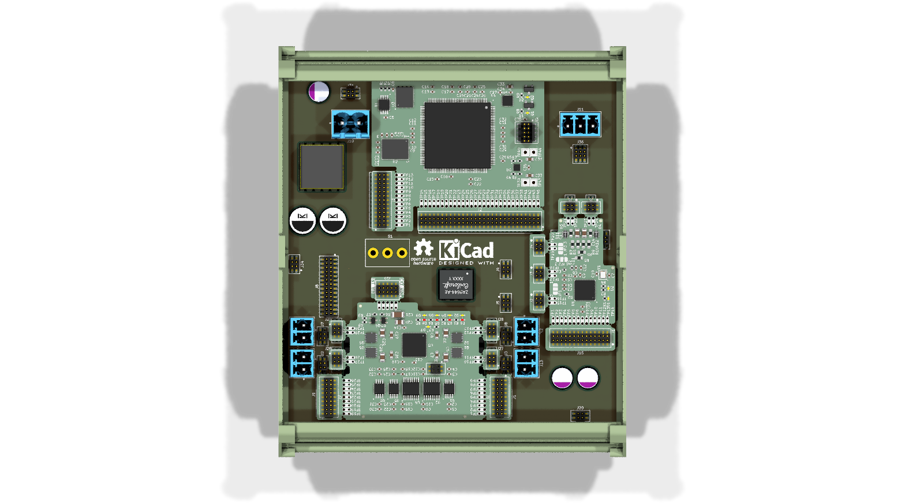
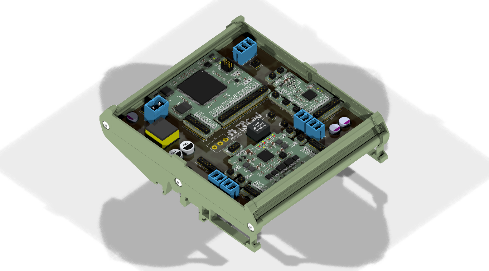
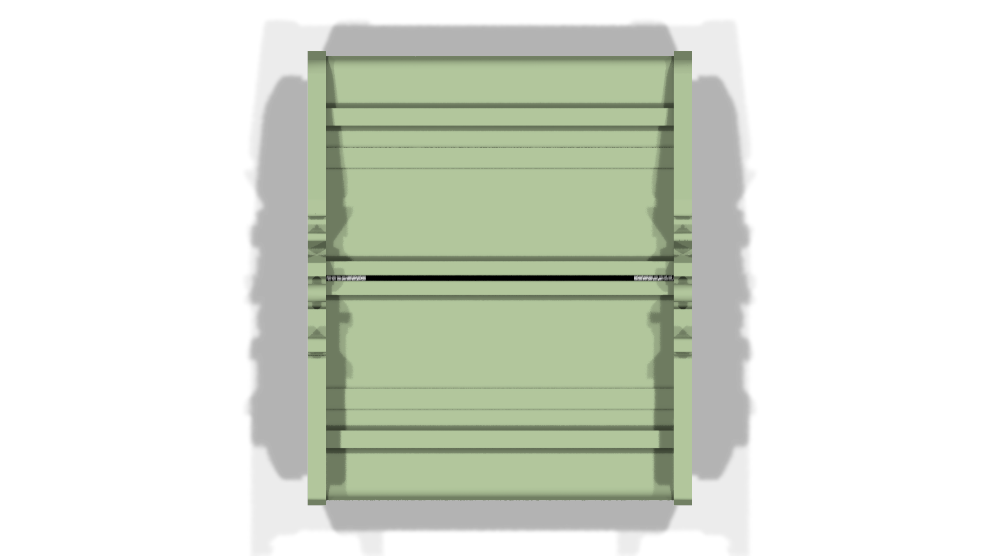
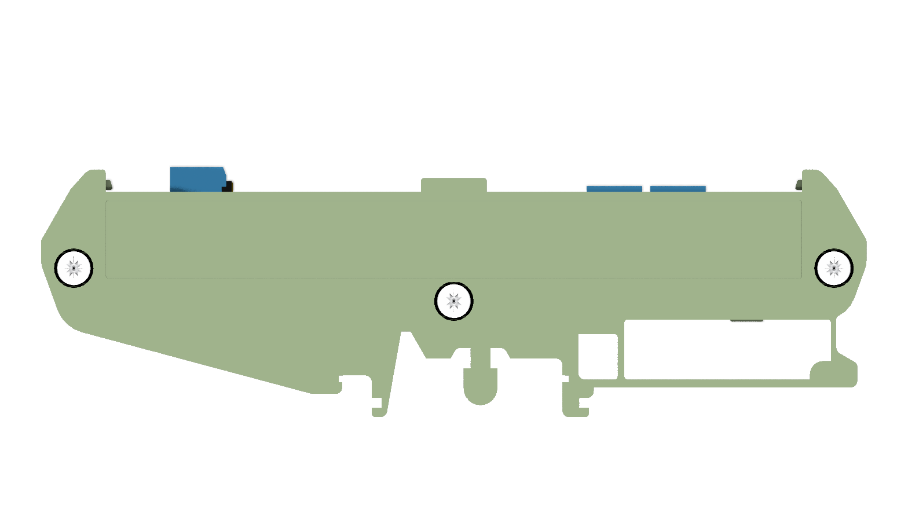
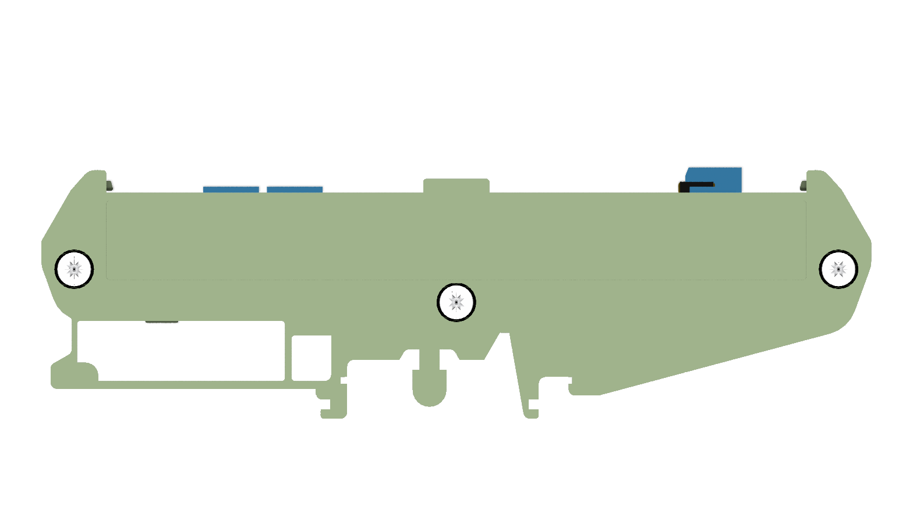
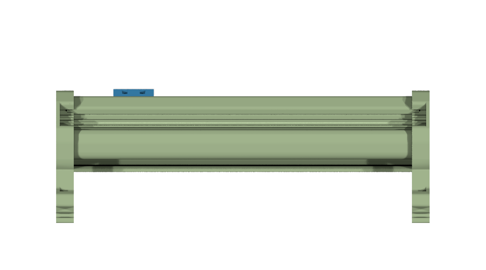

# Modular_Software_Configurable_IO_PLC

## Overview

This repository contains a modular KiCad design project for a Software Configurable I/O PLC. The project integrates several advanced components to create a versatile and powerful industrial control solution. It features software-configurable analog and digital I/O, single-pair Ethernet with Power over Data Line (PoDL) capabilities, and a robust power architecture.

## Disclaimer

> [!NOTE]
> This project is provided "as is" and without any warranty, express or implied. For more details, please see the [LICENSE](LICENSE) file.

## About the Key Components

This PLC design is built around a combination of high-performance integrated circuits:

- **Analog Devices AD74413R:** A quad-channel, software-configurable I/O solution that can be configured on a per-channel basis for analog input/output, digital input/output, and resistance temperature detector (RTD) measurements.
- **Analog Devices ADIN1110:** A low-power, single-port 10BASE-T1L MAC-PHY, enabling Ethernet connectivity over a single twisted pair of cables (Single-Pair Ethernet), ideal for long-distance communication in industrial environments.
- **Analog Devices LT8304:** A micropower, no-opto isolated flyback converter, providing a simple and efficient solution for isolated power supplies.
- **Analog Devices LTC9111:** An IEEE 802.3cg/802.3bt Power over Data Lines (PoDL) Power Sourcing Equipment (PSE) controller, allowing the PLC to power connected devices over the same data cable.
- **Maxim Integrated MAX14906:** A quad-channel, high-speed, high-side switch and digital output driver, offering robust and protected digital outputs.

## Project Structure

```
modular_software_configurable_io_plc/
├── modular_software_configurable_io_plc.kicad_pro    # Project configuration file
├── modular_software_configurable_io_plc.kicad_sch    # Main schematic file
├── modular_software_configurable_io_plc.kicad_pcb    # PCB layout file
├── fp-lib-table                                      # Footprint library table
├── sym-lib-table                                     # Symbol library table
├── docs/                                             # Documentation files
│   ├── bom/                                          # Bill of Materials
│   │   └── modular_software_configurable_io_plc_ibom.html # Interactive BOM file
│   ├── pictures/                                     # Images and photos
│   │   ├── 1_modular_software_configurable_io_plc_side.png
│   │   ├── 2_modular_software_configurable_io_plc_top.png
│   │   ├── 3_modular_software_configurable_io_plc_bottom.png
│   │   ├── 4_modular_software_configurable_io_plc_left.png
│   │   ├── 5_modular_software_configurable_io_plc_right.png
│   │   ├── 6_modular_software_configurable_io_plc_front.png
│   │   ├── 7_modular_software_configurable_io_plc_back.png
│   │   ├── 8_modular_software_configurable_io_plc_side_exploded_1.png
│   │   ├── 9_modular_software_configurable_io_plc_side_exploded_2.png
│   │   ├── 10_modular_software_configurable_io_plc_side_exploded_3.png
│   │   ├── 11_modular_software_configurable_io_plc_side_enclosure.png
│   │   ├── 12_modular_software_configurable_io_plc_top_enclosure.png
│   │   ├── 13_modular_software_configurable_io_plc_bottom_enclosure.png
│   │   ├── 14_modular_software_configurable_io_plc_left_enclosure.png
│   │   ├── 15_modular_software_configurable_io_plc_right_enclosure.png
│   │   ├── 16_modular_software_configurable_io_plc_front_enclosure.png
│   │   └── 17_modular_software_configurable_io_plc_back_enclosure.png
│   └── schematics/                                   # Schematic PDF exports
│       └── modular_software_configurable_io_plc_schematics.pdf
└── KiCAD_Symbols_Generator/                          # Submodule for symbol generation
```

## Project Features

This design provides a comprehensive and modular software-configurable I/O PLC with:

- **Modular Architecture:** Incorporates several minimal functional modules for scalability and ease of design.
- **Software-Configurable I/O:** Flexible channels that can be adapted to various sensor and actuator types.
- **Single-Pair Ethernet (SPE):** Utilizes 10BASE-T1L technology for long-reach Ethernet communication.
- **Power over Data Line (PoDL):** Capable of providing power to remote devices over the data line, simplifying wiring.
- **Isolated Power:** Features an isolated power supply for improved safety and noise immunity.
- **High-Side Digital Outputs:** Robust and protected digital outputs suitable for industrial loads.

## Getting Started

### Prerequisites

- [KiCad EDA](https://www.kicad.org/) version 9.0 or later installed on your system.
- Git for cloning the repository and managing submodules.

### Opening the Project

1.  **Clone the repository** (including submodules):
    ```bash
    git clone --recursive https://github.com/ionutms/Modular_Software_Configurable_IO_PLC.git
    ```
    If you have already cloned the repository without submodules, initialize them with:
    ```bash
    git submodule init
    git submodule update
    ```

2.  **Open the project in KiCad**:
    -   Launch KiCad.
    -   Click "Open Existing Project".
    -   Navigate to the cloned repository folder.
    -   Select the `modular_software_configurable_io_plc.kicad_pro` file.

3.  **Explore the design**:
    -   Open the schematic editor to view the circuit design.
    -   Open the PCB editor to view the board layout.

## Dependencies

This project has the following dependencies:

### 1. KiCAD Symbols Generator

This repository uses [KiCAD_Symbols_Generator](https://github.com/ionutms/KiCAD_Symbols_Generator) as a submodule for custom symbol generation.

To initialize the submodule after cloning this repository:

```bash
git submodule update --init --recursive
```

### 2. 3D Models

This project requires the [3D_Models_Vault](https://github.com/ionutms/3D_Models_Vault) repository for 3D models.

#### Setup for KiCAD 9:

1.  Clone the 3D models repository:
    ```bash
    git clone https://github.com/ionutms/3D_Models_Vault.git
    ```

2.  In KiCad 9, add an environment variable:
    -   Go to `Preferences` -> `Configure Paths...`
    -   Click `Add` to create a new environment variable.
    -   **Variable Name:** `KICAD9_3D_MODELS_VAULT`
    -   **Variable Path:** The full, absolute path to where you cloned the `3D_Models_Vault` repository.

## Symbol Generator Submodule

This project includes the [KiCAD_Symbols_Generator](https://github.com/ionutms/KiCAD_Symbols_Generator) as a submodule, which provides tools for generating KiCad symbols from CSV data files. For more information on using this tool, see the documentation within the submodule's directory.

## Documentation

The `docs` folder contains:
-   Schematic PDF exports.
-   An interactive Bill of Materials (BOM).
-   Images and renderings of the PCB and enclosure.

## Visuals

The following images showcase the PCB design from different perspectives:

### PCB Views

*Top View of the PCB*


*Side View of the PCB*


*Bottom View of the PCB*


*Left View of the PCB*


*Right View of the PCB*


*Front View of the PCB*


*Back View of the PCB*

### Exploded Views

*Side Exploded View 1*


*Side Exploded View 2*


*Side Exploded View 3*

### Enclosure Views

*Side View with Enclosure*


*Top View with Enclosure*


*Bottom View with Enclosure*


*Left View with Enclosure*


*Right View with Enclosure*


*Front View with Enclosure*


*Back View with Enclosure*

## License

This project is licensed under the MIT License - see the [LICENSE](LICENSE) file for details.

## References

- [AD74413R Datasheet](https://www.analog.com/en/products/ad74413r.html)
- [ADIN1110 Datasheet](https://www.analog.com/en/products/adin1110.html)
- [LT8304 Datasheet](https://www.analog.com/en/products/lt8304.html)
- [LTC9111 Datasheet](https://www.analog.com/en/products/ltc9111.html)
- [MAX14906 Datasheet](https://www.maximintegrated.com/en/products/interface/digital-io/max14906.html)
- [KiCad EDA](https://www.kicad.org/)